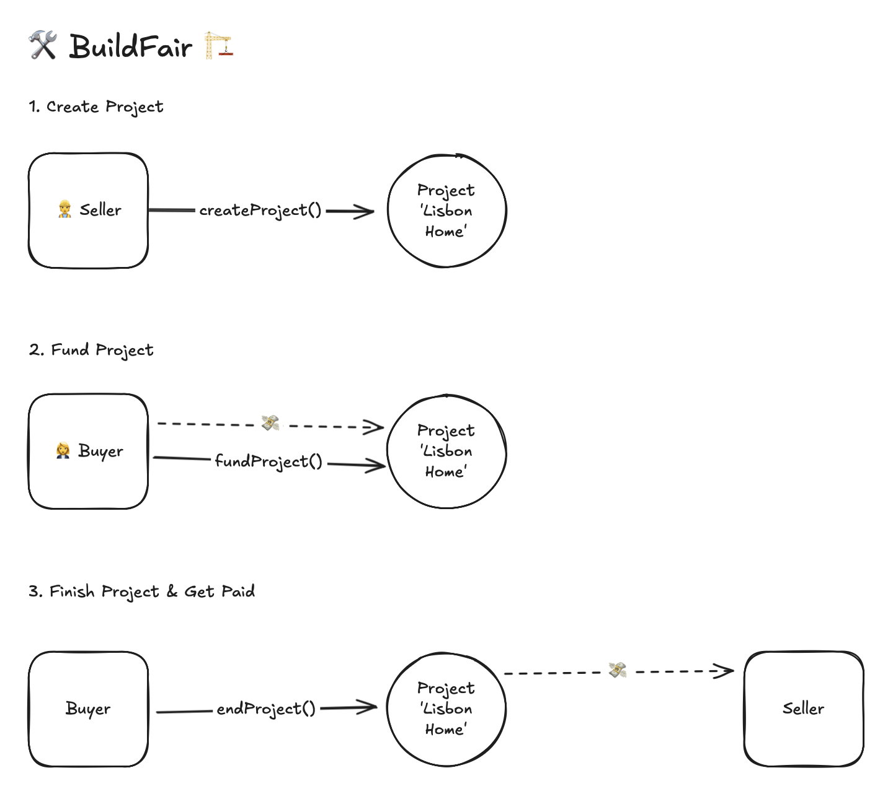

# 🛠️ BuildFair: Construction Project with Jury 🏗️

[](https://buildfair.vercel.app)

Welcome to BuildFair—your smart contract solution for secure, transparent, and fair construction agreements between buyers, sellers, and jurors.

## Table of Contents

- [🛠️ BuildFair: Construction Project with Jury 🏗️](#️-buildfair-construction-project-with-jury-️)
  - [Table of Contents](#table-of-contents)
  - [Overview](#overview)
  - [Video Demo](#video-demo)
  - [User Flows](#user-flows)
  - [Features](#features)
  - [Roles](#roles)
  - [Project States](#project-states)
  - [Functions](#functions)
  - [Project Attributes](#project-attributes)
  - [Deployment Guide](#deployment-guide)
  - [Development Setup](#development-setup)
    - [Using Nix (Recommended)](#using-nix-recommended)
    - [Manual Setup (Alternative)](#manual-setup-alternative)
  - [Contact](#contact)

## Overview

BuildFair ensures that payments are made only after validated work is achieved, protecting all parties and providing a foolproof framework for resolving disputes. Enjoy straightforward, transparent agreements with zero grey areas. _(Milestone and dispute resolution features coming in future releases)_

## Video Demo
Watch our deployment walkthrough and contract interaction demo on YouTube:
[BuildFair Demo & Walkthrough](https://youtu.be/3LFcuid21XA)

## User Flows


The diagram above illustrates how users interact with the BuildFair protocol, showing the flow of actions between buyers and sellers.

## Features

- **Buyer**: Funds the project and approves work completion.
- **Seller**: Executes construction tasks and submits evidence of completion.
- **Jury**: Acts as a neutral mediator to resolve disputes fairly. _(To be implemented in future releases)_
- **Milestones**: Break down projects into verifiable stages. _(Coming in future releases)_

## Roles

| Role                | Description                                                                   |
|---------------------|-------------------------------------------------------------------------------|
| 👩‍💼 **Buyer**      | Funds the project and verifies completed work.                              |
| 👷 **Seller**       | Executes construction tasks and submits completion evidence.                 |
| ⚖️ **Jury**         | A neutral party that resolves disputes between buyers and sellers. _(Coming soon)_ |

## Project States

- **Created (📝)**: Project created but unfunded.
- **Funded (💰)**: Buyer has deposited funds.
- **InProgress (🔨)**: Work is under review after the seller's submission.  _(Future feature)_
- **Disputed (🚨)**: A dispute has been raised; awaits jury resolution. _(Future feature)_
- **Ended (✅)**: Project finalized and funds distributed accordingly.

## Functions

- `createProject()`: Creates a new project 🌱.
- `fundProject()`: Buyer funds the project 💵.
- `submitWork()`: Seller submits completed work 🏗️. _(Coming in future release)_
- `approveWork()`: Buyer approves work and releases payment 💸. _(Coming in future release)_
- `raiseDispute()`: Either party may raise a dispute if issues arise 🚨. _(Coming in future release)_
- `resolveDispute()`: Jury resolves the dispute and directs fund allocation ⚖️. _(Coming in future release)_
- `endProject()`: Finalizes the project upon successful completion 🎉. Seller receives funds 💵. 

## Project Attributes

- `projectId`: Unique identifier for the project.
- `buyer`: Address of the buyer.
- `seller`: Address of the seller.
- `amount`: Amount of funds in the project.
- `status`: Current status of the project.
- `details`: Project details.

## Deployment Guide

1. **Access Remix IDE**
   - Visit [Remix IDE](https://remix.ethereum.org)
   - Click "Clone Git Repository"
   - Enter `https://github.com/helenaboing/buildfair`
   - Navigate to `contract/src/BuildFair.sol`

2. **Compile the Contract**
   - Select Solidity Compiler (version 0.8.13 or higher)
   - Click "Compile BuildFair.sol"

3. **Deploy the Contract**
   - Go to "Deploy & Run Transactions"
   - Connect MetaMask to your chosen network
   - Select "Injected Provider - MetaMask"
   - Enter constructor parameters:
     - `sellerAddress`: Address of the seller
     - `projectAmount`: Amount in wei
   - Click "Deploy"

4. **Interact with the Contract**
   - Use Remix's interface to call contract functions
   - All transactions will require MetaMask confirmation

## Development Setup

### Using Nix (Recommended)

BuildFair leverages [Nix](https://nixos.org/) for a unified, reproducible development environment.

1. **Install Nix**

   **Linux/macOS**:
   ```bash
   sh <(curl -L https://nixos.org/nix/install) --daemon
   ```

   **Windows**:
   - Install WSL2 (Windows Subsystem for Linux)
   - Install Ubuntu from the Microsoft Store
   - Open Ubuntu and run the Linux installation command above

2. **Enable Flakes**

   Add to your `~/.config/nix/nix.conf` or `/etc/nix/nix.conf`:
   ```bash
   experimental-features = nix-command flakes
   ```

3. **Start Development Environment**
   ```bash
   # Clone the repository
   git clone https://github.com/helenaboing/buildfair
   cd buildfair

   # Enter the development environment
   nix develop
   ```

   This environment provisions:
   - **Node.js 20.x** with pnpm
   - **Foundry** for streamlined smart contract development
   - **Solidity Compiler**
   - Additional development tools and dependencies

### Manual Setup (Alternative)

Install these dependencies manually:

1. **Node.js**: Install Node.js 20.x from [nodejs.org](https://nodejs.org/).
2. **pnpm**: Install globally:
   ```bash
   npm install -g pnpm
   ```
3. **Foundry**: Follow the installation instructions at [getfoundry.sh](https://getfoundry.sh).
4. **Solidity**: Install solc version 0.8.23.

Then, install project dependencies:
```bash
pnpm install
cd contract && forge install
```

## Contact

For questions or feedback, please reach out at [helenaboing@gmail.com](mailto:helenaboing@gmail.com) 📧.

---

Let BuildFair make your construction agreements secure, transparent, and stress-free! 🛠️✨
